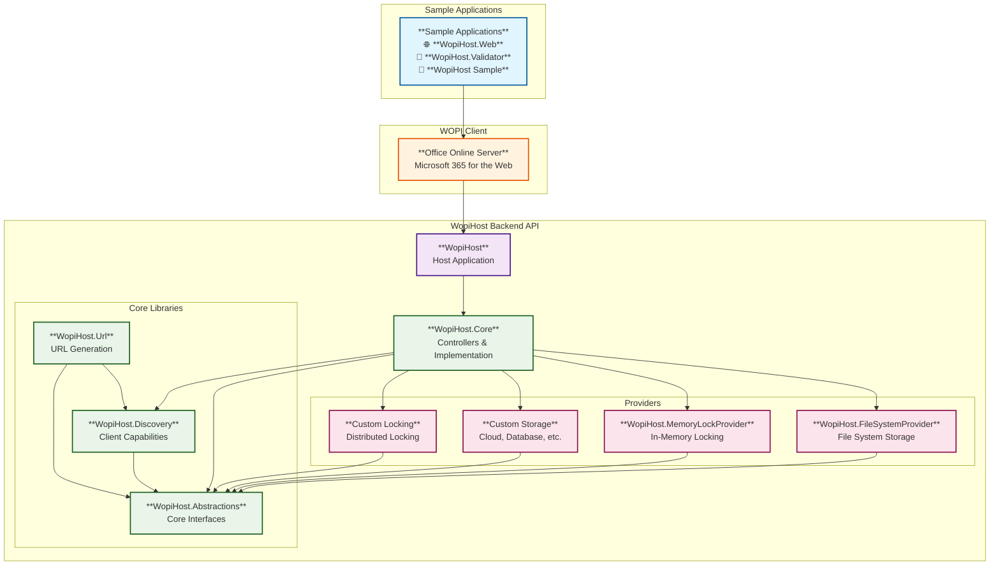

#  WopiHost

[](https://github.com/petrsvihlik/WopiHost/actions/workflows/integrate.yml)
[](https://codecov.io/gh/petrsvihlik/WopiHost) 
[](https://qlty.sh/gh/petrsvihlik/projects/WopiHost)
[](https://codeclimate.com/github/petrsvihlik/WopiHost/maintainability)
[](https://qlty.sh/gh/petrsvihlik/projects/WopiHost)
[](https://www.codefactor.io/repository/github/petrsvihlik/wopihost/overview/master)
[](https://app.fossa.com/projects/git%2Bgithub.com%2Fpetrsvihlik%2FWopiHost?ref=badge_shield)
[](https://dotnet.microsoft.com/download/dotnet/10.0)

| Package | Version | Downloads |
| ------------- | :-------------: | :-------------: | 
| `WopiHost.Abstractions` | [](https://www.nuget.org/packages/WopiHost.Abstractions) | [](https://www.nuget.org/packages/WopiHost.Abstractions) |
| `WopiHost.Core` | [](https://www.nuget.org/packages/WopiHost.Core) | [](https://www.nuget.org/packages/WopiHost.Core) |
| `WopiHost.Discovery` | [](https://www.nuget.org/packages/WopiHost.Discovery) | [](https://www.nuget.org/packages/WopiHost.Discovery) |
| `WopiHost.FileSystemProvider` | [](https://www.nuget.org/packages/WopiHost.FileSystemProvider) | [](https://www.nuget.org/packages/WopiHost.FileSystemProvider) |
| `WopiHost.MemoryLockProvider` | [](https://www.nuget.org/packages/WopiHost.MemoryLockProvider) | [](https://www.nuget.org/packages/WopiHost.MemoryLockProvider) |
| `WopiHost.Url` | [](https://www.nuget.org/packages/WopiHost.Url) | [](https://www.nuget.org/packages/WopiHost.Url) |


Introduction
==========
This project is a sample implementation of a WOPI host. Basically, it allows developers to integrate custom datasources with Office Online Server (formerly Office Web Apps) or any other WOPI client by implementing a bunch of interfaces.

## Architecture

The WopiHost project is built using a modular architecture that separates concerns and allows for flexible implementations. Here's how the modules work together:



### How It Works

1. **Sample Applications**: The `/sample` folder contains complete applications that embed the WOPI client:
   - **WopiHost.Web**: A web application with file management UI that embeds Office Online Server
   - **WopiHost.Validator**: A testing tool for WOPI protocol validation
   - **WopiHost Sample**: A basic WOPI host implementation

2. **WOPI Client Integration**: The sample applications embed Office Online Server or Microsoft 365 for the Web as a WOPI client component.

3. **WopiHost Backend API**: The WOPI client depends on the WopiHost backend API (NuGet packages) to serve files:
   - **WopiHost.Core**: Implements the WOPI REST API endpoints, handles authentication, authorization, and orchestrates all operations
   - **WopiHost.Abstractions**: Defines the core interfaces for storage, security, and locking functionality
   - **WopiHost.Discovery**: Queries the WOPI client to understand its capabilities
   - **WopiHost.Url**: Generates proper WOPI URLs based on discovered capabilities

4. **Storage & Lock Providers**: The WOPI client uses these providers to access and manage files:
   - **WopiHost.FileSystemProvider**: File system storage implementation
   - **WopiHost.MemoryLockProvider**: In-memory locking implementation
   - **Custom Providers**: You can implement your own storage and locking providers

5. **Your Own Applications**: You can create your own applications by embedding the WOPI client and referencing the WopiHost NuGet packages.

This modular design allows you to:
- **Use the sample applications** as starting points for your own WOPI-enabled applications
- **Embed the WOPI client** in your own applications
- **Reference individual WopiHost packages** to customize the backend API
- **Implement custom providers** for your specific storage or infrastructure needs
- **Test easily** with the included validator and sample implementations

Key Differentiators
-------------------
 - **Modular Architecture**: Complete separation of concerns with 6 dedicated NuGet packages (Abstractions, Core, Discovery, Url, FileSystemProvider, MemoryLockProvider) allowing selective integration
 - **WOPI Discovery Integration**: Dynamic capability detection that queries Office Online Server to determine supported file types and actions, with intelligent URL template resolution and caching
 - **Advanced Cobalt Support**: Optional MS-FSSHTTP protocol integration for enhanced performance and compatibility with Office Web Apps 2013+ features
 - **Flexible Storage Abstraction**: Complete decoupling from file system with clean interfaces supporting any storage backend (cloud, database, custom APIs) through `IWopiStorageProvider`
 - **.NET Aspire Integration**: Modern cloud-native development experience with service orchestration, OpenTelemetry observability, and containerization support
 - **Comprehensive WOPI Compliance**: Full implementation of the current WOPI specification including file operations, container operations (basic), and ecosystem support (basic)
 - **Enterprise-Ready Security**: Built-in WOPI proof validation, origin checking, and extensible authentication/authorization with JWT token support
 - **Production-Ready Features**: Health checks, in-memory caching, and sample applications for testing and validation
 
Usage
=====

Prerequisites
-------------
 - [.NET 8 SDK](https://dotnet.microsoft.com/download/dotnet/8.0), [.NET 9 SDK](https://dotnet.microsoft.com/download/dotnet/9.0), or [.NET 10 SDK](https://dotnet.microsoft.com/download/dotnet/10.0)
 - Recommended: [VS Code](https://code.visualstudio.com/) or [Visual Studio 2022](https://visualstudio.microsoft.com/vs/)

Building the app
----------------
The WopiHost app targets `net8.0`, `net9.0`, and `net10.0`.

If you need a version that targets an older version of .NET, check out the releases:
- [.NET 6](TBD)
- [.NET 5](https://github.com/petrsvihlik/WopiHost/releases/tag/3.0.0)
- [.NET Core 2.1 + .NET Framework 4.6](https://github.com/petrsvihlik/WopiHost/releases/tag/1.0.0)
- [.NET Core 3.1 + .NET Standard 2.1](https://github.com/petrsvihlik/WopiHost/releases/tag/2.0.0)

If you get errors saying that Microsoft.CobaltCore.*.nupkg can't be found, then just remove the reference or see the chapter [Cobalt](#Cobalt) below.

Running with .NET Aspire
------------------------
This project includes a .NET Aspire orchestration for easy development and deployment. .NET Aspire provides a comprehensive developer experience for building cloud-native applications with .NET.

### Prerequisites for .NET Aspire
- [.NET 10 SDK](https://dotnet.microsoft.com/download/dotnet/10.0) (required for the AppHost project)
- [Docker Desktop](https://www.docker.com/products/docker-desktop) (for containerization support)
- Recommended: [Visual Studio 2022](https://visualstudio.microsoft.com/vs/) with the .NET Aspire workload, or [VS Code](https://code.visualstudio.com/) with the C# Dev Kit extension

### Running the application with .NET Aspire

1. **Clone the repository:**
   ```bash
   git clone https://github.com/petrsvihlik/WopiHost.git
   cd WopiHost
   ```

2. **Run the Aspire AppHost:**
   ```bash
   dotnet run --project infra/WopiHost.AppHost
   ```

   This will start all three components of the application:
   - **WopiHost** (Backend service) - `http://localhost:5000`
     - API endpoints for WOPI operations
     - Swagger UI available at `/scalar`
   - **WopiHost.Web** (Frontend) - `http://localhost:6000` (HTTP) / `https://localhost:6001` (HTTPS)
     - Web interface for file management and WOPI client integration
   - **WopiHost.Validator** (Testing tool) - `http://localhost:7000`
     - WOPI protocol validation and testing interface

3. **Access the Aspire Dashboard:**
   When you run the AppHost, .NET Aspire will automatically open the Aspire dashboard in your browser. The dashboard provides:
   - Real-time application status and health monitoring
   - Structured logging and trace visualization
   - Resource management and configuration
   - Inter-service communication monitoring


### Aspire Benefits

Using .NET Aspire with WopiHost provides several advantages:

- **Service Orchestration**: Automatically manages dependencies between WopiHost, Web frontend, and Validator
- **Configuration Management**: Centralized configuration through the AppHost
- **Observability**: Built-in logging, metrics, and distributed tracing
- **Development Experience**: Simplified local development with automatic service discovery
- **Production Ready**: Easy deployment to cloud environments with container support

### Configuration

The Aspire configuration can be customized in `infra/WopiHost.AppHost/Program.cs`. The current setup includes:

- Service references and dependencies
- Port assignments for each service
- External endpoint configuration for web access
- Health monitoring and readiness checks

You can also customize application settings through:
- `infra/WopiHost.AppHost/appsettings.json`
- `infra/WopiHost.AppHost/appsettings.Development.json`

### Alternative: Running individual projects

If you prefer to run the projects individually without Aspire:

```bash
# Terminal 1 - Backend
dotnet run --project sample/WopiHost

# Terminal 2 - Frontend  
dotnet run --project sample/WopiHost.Web

# Terminal 3 - Validator (optional)
dotnet run --project sample/WopiHost.Validator
```
 
Samples
-----------

See [Samples](https://github.com/petrsvihlik/WopiHost/blob/master/sample/README.md) for all samples.

Compatible WOPI Clients
-------
Running the application only makes sense with a WOPI client as its counterpart. WopiHost is compatible with the following clients:

 #### Office Online Server 2016 
 
 [deployment guidelines](https://learn.microsoft.com/officeonlineserver/deploy-office-online-server)

Note that WopiHost will always be compatible only with the latest version of OOS because Microsoft also [supports only the latest version](https://learn.microsoft.com/officeonlineserver/office-online-server-release-schedule).

The deployment of OOS/OWA requires the server to be part of a domain. If your server is not part of any domain (e.g. you're running it in a VM sandbox) it can be overcome by promoting your machine to a [Domain Controller](https://social.technet.microsoft.com/wiki/contents/articles/12370.windows-server-2012-set-up-your-first-domain-controller-step-by-step.aspx).
To test your OWA server [follow the instructions here](https://learn.microsoft.com/office/troubleshoot/administration/test-viewing-documents-by-using-office-online-server-viewer).
To remove the OWA instance use [`Remove-OfficeWebAppsMachine`](http://sharepointjack.com/2014/fun-configuring-office-web-apps-2013-owa/).

#### Microsoft 365 for the Web 

You can [use WopiHost to integrate with Microsoft 365 for the web](https://learn.microsoft.com/microsoft-365/cloud-storage-partner-program/online) which will require:
- onboarding - [apply for CSPP](https://learn.microsoft.com/microsoft-365/cloud-storage-partner-program/online/apply-for-cspp-program)
- extending the provided interfaces to support the required features by Microsoft; we provide a sample implementation of the interfaces that pass the interactive [WOPI-Validator](https://learn.microsoft.com/microsoft-365/cloud-storage-partner-program/online/build-test-ship/validator) tests
- [Test Microsoft 365 for the web integration](https://learn.microsoft.com/microsoft-365/cloud-storage-partner-program/online/build-test-ship/testing)

Cobalt
------
In the past (in Office Web Apps 2013), some HTTP actions required the support of MS-FSSHTTP protocol (also known as "cobalt"). This is no longer true with Office Online Server 2016.
However, if the WOPI client discovers (via [SupportsCobalt](https://learn.microsoft.com/microsoft-365/cloud-storage-partner-program/rest/files/checkfileinfo#supportscobalt) property) that the WOPI host supports cobalt, it'll take advantage of it as it's more efficient.

If you need or want your project to use Cobalt, you'll need to [create a NuGet package called Microsoft.CobaltCore.nupkg](https://github.com/petrsvihlik/WopiHost/wiki/Craft-your-own-Microsoft.CobaltCore-NuGet-package) containing Microsoft.CobaltCore.dll. This DLL is part of Office Web Apps 2013 / Office Online Server 2016, and its license doesn't allow public distribution and therefore, it's not part of this repository. Please always make sure your OWA/OOS server and the user connecting to it have valid licenses before you start using it.


Using in your web project
-------------------------
TODO

Extending
=========

### IWopiStorageProvider

The `IWopiStorageProvider` interface is the main interface that needs to be implemented to provide access to the files. It's up to you how you implement it. One sample implementation is in the `WopiHost.FileSystemProvider` project.

### IWopiSecurityHandler

The `IWopiSecurityHandler` interface is used to authenticate and authorize resource requests. One sample implementation is in the `WopiHost.FileSystemProvider` project.

### IWopiLockProvider

The `IWopiLockProvider` interface is used to handle file locks. One sample implementation is in the `WopiHost.MemoryLockProvider` project.

### CheckFileInfo

The [CheckFileInfo](https://learn.microsoft.com/microsoft-365/cloud-storage-partner-program/rest/files/checkfileinfo) includes not only details about the file but also some additional properties that can be used by the WOPI client. You can either completely customize the response (by adding your own / missing properties), or update any properties before returning them by registering for the OnCheckFileInfo event.

### CheckContainerInfo

The [CheckContainerInfo](https://learn.microsoft.com/microsoft-365/cloud-storage-partner-program/rest/containers/checkcontainerinfo) includes also some security related properties (that are checked by IWopiSecurityHandler), but you can still customize the response using the OnCheckContainerInfo event.


TODO additional details

Known issues / TODOs
==================
There is plenty of space for improvements in the overall architecture, implementation of the [MS-*] protocols, or just finishing the TODOs in the code. A lot of refactoring still needs to be done and also the code style has to be unified. So please feel free to help me out with it :)

 - Check out [open issues](https://github.com/petrsvihlik/WopiHost/issues?q=is%3Aopen)

Contributing
==========
https://learn.microsoft.com/dotnet/standard/design-guidelines/

License
=======
 - [LICENSE.txt](https://github.com/petrsvihlik/WopiHost/blob/master/LICENSE.txt) - License for my part of the project
 - [ORIGINAL_WORK_LICENSE.txt](https://github.com/petrsvihlik/WopiHost/blob/master/src/WopiHost.Cobalt/ORIGINAL_WORK_LICENSE.txt) - License for Marx Yu's part of the project. This project is based on [Marx Yu's project](https://github.com/marx-yu/WopiHost).
 - [NOTICE.txt](https://github.com/petrsvihlik/WopiHost/blob/master/NOTICE.txt) - additional notes to how the licenses are applied


Useful resources
=============
Building WOPI Host
-----------------------
 - [Official WOPI Documentation](https://learn.microsoft.com/microsoft-365/cloud-storage-partner-program/rest/)
 - [Official WOPI REST API Reference](https://learn.microsoft.com/openspecs/office_protocols/ms-wopi/6a8bb410-68ad-47e4-9dc3-6cf29c6b046b)
 - [WOPI Host and url paths](https://www.cicoria.com/office-web-appswopi-host-and-url-paths/)
 - [Office Online integration via WOPI Host by Richard diZerega](https://github.com/OfficeDev/PnP-WOPI) + [video](https://www.youtube.com/watch?v=9lGonu0eoGA)

MS-FSSHTTP (Cobalt)
-------
 - https://learn.microsoft.com/openspecs/sharepoint_protocols/ms-fsshttp/6d078cbe-2651-43a0-b460-685ac3f14c45

Building WOPI Client
-------------------------
 - [SharePoint 2013: Building your own WOPI Client, part 1](https://www.wictorwilen.se/blog/sharepoint-2013-building-your-own-wopi-client-part-1/)
 - [SharePoint 2013: Building your own WOPI Client, part 2](https://www.wictorwilen.se/blog/sharepoint-2013-building-your-own-wopi-client-part-2/)


[](https://app.fossa.com/projects/git%2Bgithub.com%2Fpetrsvihlik%2FWopiHost?ref=badge_large)
