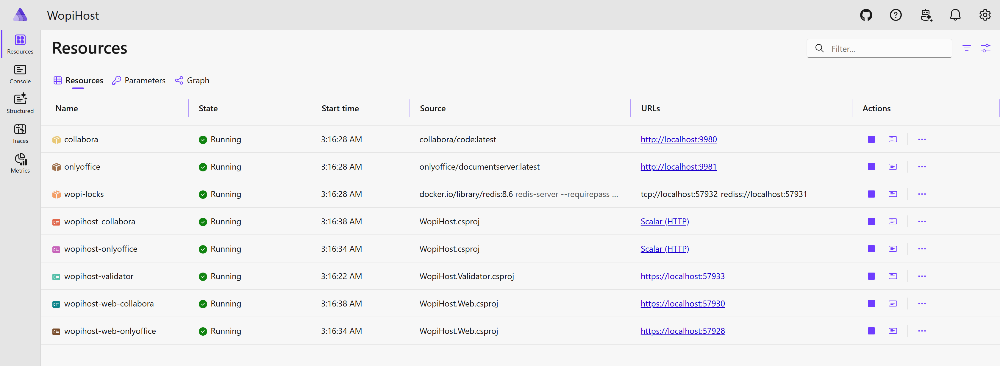

#  WopiHost

[](https://github.com/petrsvihlik/WopiHost/actions/workflows/integrate.yml)
[](https://codecov.io/gh/petrsvihlik/WopiHost)
[](https://qlty.sh/gh/petrsvihlik/projects/WopiHost)
[](https://qlty.sh/gh/petrsvihlik/projects/WopiHost)
[](https://www.codefactor.io/repository/github/petrsvihlik/wopihost/overview/master)
[](https://app.fossa.com/projects/git%2Bgithub.com%2Fpetrsvihlik%2FWopiHost?ref=badge_small)
[](https://dotnet.microsoft.com/download/dotnet/10.0)

A modular **WOPI host** implementation for .NET that lets you plug your own data source into Office Online Server, Microsoft 365 for the Web, or any other WOPI client by implementing a small set of interfaces.

## Packages

| Package | What it does | Version | Downloads |
|---|---|:-:|:-:|
| [WopiHost.Abstractions](src/WopiHost.Abstractions/README.md) | Interfaces every other package builds on (`IWopiStorageProvider`, `IWopiLockProvider`, `IWopiPermissionProvider`, `IWopiAccessTokenService`) | [](https://www.nuget.org/packages/WopiHost.Abstractions) | [](https://www.nuget.org/packages/WopiHost.Abstractions) |
| [WopiHost.Core](src/WopiHost.Core/README.md) | The WOPI server — Minimal-API endpoints, JWT auth, proof validation (`AddWopi()` + `app.MapWopiEndpoints()`, `ConfigureWopiSecurity()`) | [](https://www.nuget.org/packages/WopiHost.Core) | [](https://www.nuget.org/packages/WopiHost.Core) |
| [WopiHost.Discovery](src/WopiHost.Discovery/README.md) | Reads the WOPI client's discovery XML (`IDiscoverer`, `IDiscoveryFileProvider`) | [](https://www.nuget.org/packages/WopiHost.Discovery) | [](https://www.nuget.org/packages/WopiHost.Discovery) |
| [WopiHost.Url](src/WopiHost.Url/README.md) | Builds the URLs you embed in iframes (`WopiUrlBuilder`, `WopiUrlSettings`) | [](https://www.nuget.org/packages/WopiHost.Url) | [](https://www.nuget.org/packages/WopiHost.Url) |
| [WopiHost.FileSystemProvider](src/WopiHost.FileSystemProvider/README.md) | Reference storage backed by a directory tree | [](https://www.nuget.org/packages/WopiHost.FileSystemProvider) | [](https://www.nuget.org/packages/WopiHost.FileSystemProvider) |
| [WopiHost.MemoryLockProvider](src/WopiHost.MemoryLockProvider/README.md) | In-process lock store (single instance / dev) | [](https://www.nuget.org/packages/WopiHost.MemoryLockProvider) | [](https://www.nuget.org/packages/WopiHost.MemoryLockProvider) |
| [WopiHost.AzureStorageProvider](src/WopiHost.AzureStorageProvider/README.md) | Storage backed by Azure Blob Storage | [](https://www.nuget.org/packages/WopiHost.AzureStorageProvider) | [](https://www.nuget.org/packages/WopiHost.AzureStorageProvider) |
| [WopiHost.AzureLockProvider](src/WopiHost.AzureLockProvider/README.md) | Distributed lock store backed by Azure Blob leases (strongest cross-instance exclusion) | [](https://www.nuget.org/packages/WopiHost.AzureLockProvider) | [](https://www.nuget.org/packages/WopiHost.AzureLockProvider) |
| [WopiHost.RedisLockProvider](src/WopiHost.RedisLockProvider/README.md) | Best-effort distributed lock store backed by Redis (Lua-scripted compare-and-swap) | [](https://www.nuget.org/packages/WopiHost.RedisLockProvider) | [](https://www.nuget.org/packages/WopiHost.RedisLockProvider) |
| [WopiHost.Cobalt](src/WopiHost.Cobalt/README.md) | Optional MS-FSSHTTP support (off by default; needs the private `Microsoft.CobaltCore` feed — see [Cobalt](https://github.com/petrsvihlik/WopiHost/wiki/Cobalt)) | _not published_ | — |

## Why use it?

- **Modular [architecture](https://github.com/petrsvihlik/WopiHost/wiki/Architecture)** — selective integration via 10 dedicated NuGet packages, clean separation between protocol, storage, and locking.
- **Flexible storage** — implement `IWopiStorageProvider` to put any backend behind WOPI: file system, blob storage, database, custom APIs. See [Extending WopiHost](https://github.com/petrsvihlik/WopiHost/wiki/Extending-WopiHost).
- **Comprehensive WOPI compliance** — file operations, container operations, ecosystem support, and [the bootstrapper endpoint](https://github.com/petrsvihlik/WopiHost/wiki/Bootstrap-Endpoint) for Office mobile.
- **WOPI discovery built in** — dynamic capability detection from the WOPI client with template resolution and caching.
- **Enterprise-ready security** — WOPI proof validation, origin checking, JWT access tokens, [pluggable permission/ACL providers](https://github.com/petrsvihlik/WopiHost/wiki/Extending-WopiHost#authentication--authorization).
- **.NET Aspire integration** — service orchestration, OpenTelemetry, container support out of the box.
- **Optional [Cobalt (MS-FSSHTTP)](https://github.com/petrsvihlik/WopiHost/wiki/Cobalt)** — for OOS clients that prefer the more efficient co-authoring protocol.

## Quick start

### Prerequisites

- [.NET 10 SDK](https://dotnet.microsoft.com/download/dotnet/10.0)
- [Docker Desktop](https://www.docker.com/products/docker-desktop) (used by .NET Aspire for container resources)
- Recommended: [Visual Studio 2026](https://visualstudio.microsoft.com/vs/) with the .NET Aspire workload, or [VS Code](https://code.visualstudio.com/) with the C# Dev Kit

### Run

```bash
git clone https://github.com/petrsvihlik/WopiHost.git
cd WopiHost
dotnet run --project infra/WopiHost.AppHost
```

The Aspire dashboard opens automatically and starts:

| Resource | What it is |
|---|---|
| `wopihost-collabora` | WOPI backend (Collabora lane); OpenAPI at `/scalar` |
| `wopihost-web-collabora` | Sample frontend (file picker + iframe) wired to Collabora |
| `collabora` | [Collabora Online](https://github.com/petrsvihlik/WopiHost/wiki/Collabora-Online) (CODE) container — real WOPI client for end-to-end editing |
| `wopihost-onlyoffice` | A second WOPI backend (ONLYOFFICE lane) |
| `wopihost-web-onlyoffice` | A second sample frontend wired to ONLYOFFICE |
| `onlyoffice` | [ONLYOFFICE Docs](https://github.com/ONLYOFFICE/Docker-DocumentServer) container — a second real WOPI client |
| `wopihost-validator` | WOPI protocol validator |

Each editor runs in its own lane — a dedicated backend + frontend — so they can be tested side by side. To skip a Docker image you don't want, see the [AppHost README](infra/WopiHost.AppHost/README.md#opting-out-of-docker-clients).

The dashboard shows the URL each resource is bound to — Aspire allocates ports dynamically for the frontends, so they change between runs. The first run pulls the `collabora/code` Docker image (~1 GB) and the larger `onlyoffice/documentserver` image (~4.3 GB) and takes a few minutes; if you don't want the dependency, set `"AppHost:UseCollabora": false` and/or `"AppHost:UseOnlyOffice": false` in [`infra/WopiHost.AppHost/appsettings.Development.json`](infra/WopiHost.AppHost/appsettings.Development.json).



## Documentation

Everything beyond the basics lives in the **[wiki](https://github.com/petrsvihlik/WopiHost/wiki)**:

| Topic | What's there |
|---|---|
| [Architecture](https://github.com/petrsvihlik/WopiHost/wiki/Architecture) | How the libraries, providers, frontend, and WOPI client fit together at runtime. |
| [Configuration](https://github.com/petrsvihlik/WopiHost/wiki/Configuration) | `Wopi:*` and `AppHost:*` knobs (Azure storage, OIDC sample, etc.). |
| [Hosting](https://github.com/petrsvihlik/WopiHost/wiki/Hosting) | IIS, HTTPS, Docker, running individual projects, older runtimes. |
| [Collabora Online](https://github.com/petrsvihlik/WopiHost/wiki/Collabora-Online) | End-to-end editing with CODE — AppHost wiring, NetZone / proof-key gotchas. |
| [Extending WopiHost](https://github.com/petrsvihlik/WopiHost/wiki/Extending-WopiHost) | Custom storage and lock providers, permissions, the minimal-host snippet. |
| [CheckFileInfo customization](https://github.com/petrsvihlik/WopiHost/wiki/CheckFileInfo-Customization) | Overriding the response payload via `IWopiHostExtensions` hooks. |
| [Bootstrap endpoint](https://github.com/petrsvihlik/WopiHost/wiki/Bootstrap-Endpoint) | Wiring `/wopibootstrapper` for Office mobile. |
| [Cobalt](https://github.com/petrsvihlik/WopiHost/wiki/Cobalt) | What MS-FSSHTTP buys you, and how to enable the optional Cobalt build. |
| [Useful resources](https://github.com/petrsvihlik/WopiHost/wiki/Useful-Resources) · [Interesting WOPI projects](https://github.com/petrsvihlik/WopiHost/wiki/Interesting-WOPI-projects) | Specs, external write-ups, other implementations worth a look. |

## Compatible WOPI clients

| Client | Status | Notes |
|---|---|---|
| **Office Online Server 2016+** | Production | Microsoft only [supports the latest version](https://learn.microsoft.com/officeonlineserver/office-online-server-release-schedule); WopiHost tracks the same. [Deployment guide](https://learn.microsoft.com/officeonlineserver/deploy-office-online-server). |
| **Microsoft 365 for the Web** | Production | Requires [CSPP onboarding](https://learn.microsoft.com/microsoft-365/cloud-storage-partner-program/online/apply-for-cspp-program) plus implementing the M365-specific feature surface. The provided sample passes the [WOPI-Validator](https://learn.microsoft.com/microsoft-365/cloud-storage-partner-program/online/build-test-ship/validator). |
| **Collabora Online (CODE)** | Development / CI only | Free and redistributable, runs as a Docker container. Useful for end-to-end testing without a Microsoft license; not a substitute for OOS or M365. See the [wiki](https://github.com/petrsvihlik/WopiHost/wiki/Collabora-Online) for the AppHost wiring. |
| **ONLYOFFICE Docs** | Development / CI only | Free Community edition, runs as a Docker container. A second independent WOPI client for end-to-end testing alongside Collabora; not a substitute for OOS or M365. |

## License

- [LICENSE.txt](https://github.com/petrsvihlik/WopiHost/blob/master/LICENSE.txt) — license for this project.
- [ORIGINAL_WORK_LICENSE.txt](https://github.com/petrsvihlik/WopiHost/blob/master/src/WopiHost.Cobalt/ORIGINAL_WORK_LICENSE.txt) — license for [Marx Yu's](https://github.com/marx-yu/WopiHost) original code that `WopiHost.Cobalt` is based on.
- [NOTICE.txt](https://github.com/petrsvihlik/WopiHost/blob/master/NOTICE.txt) — additional notes.
