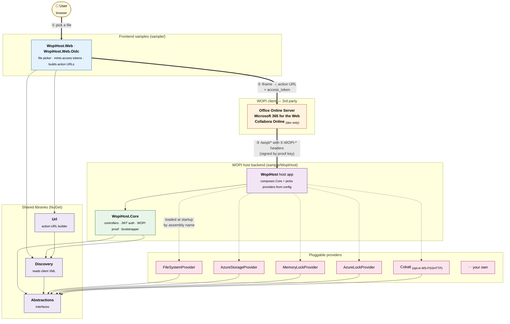

#  WopiHost

[](https://github.com/petrsvihlik/WopiHost/actions/workflows/integrate.yml)
[](https://codecov.io/gh/petrsvihlik/WopiHost) 
[](https://qlty.sh/gh/petrsvihlik/projects/WopiHost)
[](https://qlty.sh/gh/petrsvihlik/projects/WopiHost)
[](https://www.codefactor.io/repository/github/petrsvihlik/wopihost/overview/master)
[](https://app.fossa.com/projects/git%2Bgithub.com%2Fpetrsvihlik%2FWopiHost?ref=badge_shield)
[](https://dotnet.microsoft.com/download/dotnet/10.0)

| Package | Version | Downloads |
| ------------- | :-------------: | :-------------: | 
| `WopiHost.Abstractions` | [](https://www.nuget.org/packages/WopiHost.Abstractions) | [](https://www.nuget.org/packages/WopiHost.Abstractions) |
| `WopiHost.AzureLockProvider` | [](https://www.nuget.org/packages/WopiHost.AzureLockProvider) | [](https://www.nuget.org/packages/WopiHost.AzureLockProvider) |
| `WopiHost.AzureStorageProvider` | [](https://www.nuget.org/packages/WopiHost.AzureStorageProvider) | [](https://www.nuget.org/packages/WopiHost.AzureStorageProvider) |
| `WopiHost.Core` | [](https://www.nuget.org/packages/WopiHost.Core) | [](https://www.nuget.org/packages/WopiHost.Core) |
| `WopiHost.Discovery` | [](https://www.nuget.org/packages/WopiHost.Discovery) | [](https://www.nuget.org/packages/WopiHost.Discovery) |
| `WopiHost.FileSystemProvider` | [](https://www.nuget.org/packages/WopiHost.FileSystemProvider) | [](https://www.nuget.org/packages/WopiHost.FileSystemProvider) |
| `WopiHost.MemoryLockProvider` | [](https://www.nuget.org/packages/WopiHost.MemoryLockProvider) | [](https://www.nuget.org/packages/WopiHost.MemoryLockProvider) |
| `WopiHost.Url` | [](https://www.nuget.org/packages/WopiHost.Url) | [](https://www.nuget.org/packages/WopiHost.Url) |


Introduction
==========
This project is a sample implementation of a WOPI host. Basically, it allows developers to integrate custom datasources with Office Online Server (formerly Office Web Apps) or any other WOPI client by implementing a bunch of interfaces.

## Architecture

The WopiHost project is built using a modular architecture that separates concerns and allows for flexible implementations. Here's how the modules work together:


```mermaid
graph TB
    User(["👤 User<br/><sub>browser</sub>"])

    subgraph Frontend ["Frontend samples (sample/)"]
        Web["<b>WopiHost.Web</b> · <b>WopiHost.Web.Oidc</b><br/><sub>file picker · mints access tokens · builds action URLs</sub>"]
    end

    subgraph WopiClient ["WOPI client — 3rd-party"]
        WC["<b>Office Online Server</b><br/><b>Microsoft 365 for the Web</b><br/><b>Collabora Online</b> <sub>(dev only)</sub>"]
    end

    subgraph Backend ["WOPI host backend (sample/WopiHost)"]
        Host["<b>WopiHost</b> host app<br/><sub>composes Core + picks providers from config</sub>"]
        Core["<b>WopiHost.Core</b><br/><sub>controllers · JWT auth · WOPI proof · bootstrapper</sub>"]
    end

    subgraph Providers ["Pluggable providers"]
        direction LR
        FS["FileSystemProvider"]
        AzS["AzureStorageProvider"]
        Mem["MemoryLockProvider"]
        AzL["AzureLockProvider"]
        Cob["Cobalt <sub>(opt-in MS-FSSHTTP)</sub>"]
        Cust["⋯ your own"]
    end

    subgraph Libs ["Shared libraries (NuGet)"]
        Abs["<b>Abstractions</b><br/><sub>interfaces</sub>"]
        Disc["<b>Discovery</b><br/><sub>reads client XML</sub>"]
        Url["<b>Url</b><br/><sub>action-URL builder</sub>"]
    end

    %% Runtime request flow
    User ==>|"① pick a file"| Web
    Web ==>|"② iframe → action URL<br/>+ access_token"| WC
    WC ==>|"③ /wopi/* with X-WOPI-* headers<br/>(signed by proof key)"| Host

    %% Composition
    Host --> Core
    Host -. loaded at startup<br/>by assembly name .-> FS
    Host -.-> AzS
    Host -.-> Mem
    Host -.-> AzL
    Host -.-> Cob

    %% Frontend uses Url + Discovery to build the action URL
    Web --> Url
    Web --> Disc

    %% Build-time package deps
    Core --> Abs
    Core --> Disc
    Url --> Disc
    Disc --> Abs
    FS --> Abs
    AzS --> Abs
    Mem --> Abs
    AzL --> Abs
    Cob --> Abs

    classDef user fill:#fff8e1,stroke:#8a6d00,color:#000
    classDef sample fill:#e3f2fd,stroke:#0d47a1,color:#000
    classDef client fill:#fff3e0,stroke:#bf360c,color:#000
    classDef host fill:#f3e5f5,stroke:#4a148c,color:#000
    classDef server fill:#e8f5e9,stroke:#1b5e20,color:#000
    classDef provider fill:#fce4ec,stroke:#880e4f,color:#000
    classDef lib fill:#ede7f6,stroke:#311b92,color:#000

    class User user
    class Web sample
    class WC client
    class Host host
    class Core server
    class FS,AzS,Mem,AzL,Cob,Cust provider
    class Abs,Disc,Url lib
```

> **Reading the diagram**
> - **Thick arrows (`==>`)** are the runtime request flow, numbered ①–③.
> - **Thin solid arrows (`-->`)** are build-time package references.
> - **Dashed arrows (`-.->`)** mark providers that the host loads dynamically at startup by assembly name (`StorageProviderAssemblyName`, `LockProviderAssemblyName`) — Core itself does not reference them.

### How it works

1. **Frontend** (`sample/WopiHost.Web`, `sample/WopiHost.Web.Oidc`) — your web app. It authenticates the user, mints a host-issued WOPI access token (with per-resource permissions baked in via [`IWopiPermissionProvider`](src/WopiHost.Abstractions/README.md)), uses **`WopiHost.Url`** + **`WopiHost.Discovery`** to build the WOPI client's action URL, and embeds it in an iframe.

2. **WOPI client** (Office Online Server, Microsoft 365 for the Web, or Collabora Online) — the third-party renderer that actually displays / edits the document. It loads the iframe URL, then calls back to your host with `/wopi/*` requests signed by the WOPI proof key.

3. **Backend host** (`sample/WopiHost`) — composes **`WopiHost.Core`** with one storage provider and one lock provider chosen by configuration. Core handles all the WOPI REST endpoints, JWT validation, proof-key validation, the bootstrapper, and dispatch to your providers.

4. **Pluggable providers** — implement `IWopiStorageProvider` (+ optionally `IWopiWritableStorageProvider`) and/or `IWopiLockProvider`, then point the host at your assembly. Ships out of the box:
   - **Storage**: `FileSystemProvider` (local disk), `AzureStorageProvider` (Blob Storage)
   - **Locks**: `MemoryLockProvider` (single-instance / dev), `AzureLockProvider` (blob-lease, multi-instance safe)
   - **Optional**: `WopiHost.Cobalt` — MS-FSSHTTP support for older clients (requires the licensed `Microsoft.CobaltCore` NuGet, see [Cobalt](#cobalt)).

5. **Your own app** — drop in your own frontend + backend host using the same NuGet packages. The contract surface lives in **`WopiHost.Abstractions`**.

This modular design allows you to:
- **Use the sample applications** as starting points for your own WOPI-enabled applications
- **Embed the WOPI client** in your own applications
- **Reference individual WopiHost packages** to customize the backend API
- **Implement custom providers** for your specific storage or infrastructure needs
- **Test easily** with the included validator and sample implementations

Key Differentiators
-------------------
 - **Modular Architecture**: Complete separation of concerns across 9 dedicated NuGet packages — `Abstractions`, `Core`, `Discovery`, `Url`, `FileSystemProvider`, `AzureStorageProvider`, `MemoryLockProvider`, `AzureLockProvider`, `Cobalt` — allowing selective integration
 - **WOPI Discovery Integration**: Dynamic capability detection that queries Office Online Server to determine supported file types and actions, with intelligent URL template resolution and caching
 - **Advanced Cobalt Support**: Optional MS-FSSHTTP protocol integration for enhanced performance and compatibility with Office Web Apps 2013+ features
 - **Flexible Storage Abstraction**: Complete decoupling from file system with clean interfaces supporting any storage backend (cloud, database, custom APIs) through `IWopiStorageProvider`
 - **.NET Aspire Integration**: Modern cloud-native development experience with service orchestration, OpenTelemetry observability, and containerization support
 - **Comprehensive WOPI Compliance**: Full implementation of the current WOPI specification including file operations, container operations (basic), and ecosystem support (basic)
 - **Enterprise-Ready Security**: Built-in WOPI proof validation, origin checking, and extensible authentication/authorization with JWT token support
 - **Production-Ready Features**: Health checks, in-memory caching, and sample applications for testing and validation
 
Usage
=====

Prerequisites
-------------
 - [.NET 8 SDK](https://dotnet.microsoft.com/download/dotnet/8.0), [.NET 9 SDK](https://dotnet.microsoft.com/download/dotnet/9.0), or [.NET 10 SDK](https://dotnet.microsoft.com/download/dotnet/10.0)
 - Recommended: [VS Code](https://code.visualstudio.com/) or [Visual Studio 2022](https://visualstudio.microsoft.com/vs/)

Building the app
----------------
The WopiHost app targets `net8.0`, `net9.0`, and `net10.0`.

If you need a version that targets an older runtime, see the [release tags](https://github.com/petrsvihlik/WopiHost/releases). For reference:
- [.NET 5](https://github.com/petrsvihlik/WopiHost/releases/tag/3.0.0)
- [.NET Core 3.1 + .NET Standard 2.1](https://github.com/petrsvihlik/WopiHost/releases/tag/2.0.0)
- [.NET Core 2.1 + .NET Framework 4.6](https://github.com/petrsvihlik/WopiHost/releases/tag/1.0.0)

If you get errors saying that Microsoft.CobaltCore.*.nupkg can't be found, then just remove the reference or see the chapter [Cobalt](#Cobalt) below.

Running with .NET Aspire
------------------------
This project includes a .NET Aspire orchestration for easy development and deployment. .NET Aspire provides a comprehensive developer experience for building cloud-native applications with .NET.

### Prerequisites for .NET Aspire
- [.NET 10 SDK](https://dotnet.microsoft.com/download/dotnet/10.0) (required for the AppHost project)
- [Docker Desktop](https://www.docker.com/products/docker-desktop) (for containerization support)
- Recommended: [Visual Studio 2022](https://visualstudio.microsoft.com/vs/) with the .NET Aspire workload, or [VS Code](https://code.visualstudio.com/) with the C# Dev Kit extension

### Running the application with .NET Aspire

1. **Clone the repository:**
   ```bash
   git clone https://github.com/petrsvihlik/WopiHost.git
   cd WopiHost
   ```

2. **Run the Aspire AppHost:**
   ```bash
   dotnet run --project infra/WopiHost.AppHost
   ```

   This will start all three components of the application:
   - **WopiHost** (Backend service) - `http://localhost:5000`
     - API endpoints for WOPI operations
     - Swagger UI available at `/scalar`
   - **WopiHost.Web** (Frontend) - `http://localhost:6000` (HTTP) / `https://localhost:6001` (HTTPS)
     - Web interface for file management and WOPI client integration
   - **WopiHost.Validator** (Testing tool) - `http://localhost:7000`
     - WOPI protocol validation and testing interface

3. **Access the Aspire Dashboard:**
   When you run the AppHost, .NET Aspire will automatically open the Aspire dashboard in your browser. The dashboard provides:
   - Real-time application status and health monitoring
   - Structured logging and trace visualization
   - Resource management and configuration
   - Inter-service communication monitoring


### Aspire Benefits

Using .NET Aspire with WopiHost provides several advantages:

- **Service Orchestration**: Automatically manages dependencies between WopiHost, Web frontend, and Validator
- **Configuration Management**: Centralized configuration through the AppHost
- **Observability**: Built-in logging, metrics, and distributed tracing
- **Development Experience**: Simplified local development with automatic service discovery
- **Production Ready**: Easy deployment to cloud environments with container support

### Configuration

The Aspire configuration can be customized in `infra/WopiHost.AppHost/Program.cs`. The current setup includes:

- Service references and dependencies
- Port assignments for each service
- External endpoint configuration for web access
- Health monitoring and readiness checks

You can also customize application settings through:
- `infra/WopiHost.AppHost/appsettings.json`
- `infra/WopiHost.AppHost/appsettings.Development.json`

#### Optional resources (opt-in flags)

The AppHost reads a few `AppHost:*` flags so the default first-run flow stays minimal. Set them
in `infra/WopiHost.AppHost/appsettings.Development.json` (or via environment variables / user secrets):

| Flag | Adds | Notes |
|---|---|---|
| `AppHost:UseAzureStorage` | Azurite emulator + `BlobStorage` connection string forwarded to the WOPI host | Pair with `Wopi:StorageProviderAssemblyName=WopiHost.AzureStorageProvider` in `sample/WopiHost`. |
| `AppHost:UseCollabora` | Collabora Online Development Edition (CODE) container as a real WOPI client | See [End-to-end editing with Collabora Online](#end-to-end-editing-with-collabora-online) below. |
| `AppHost:IncludeOidcSample` | `WopiHost.Web.Oidc` frontend | Requires IdP configuration — see [`sample/WopiHost.Web.Oidc/README.md`](sample/WopiHost.Web.Oidc/README.md). |

#### End-to-end editing with Collabora Online

Office Online Server / M365 for the Web cannot legally be redistributed in a Docker image, so the
AppHost ships [Collabora Online Development Edition](https://www.collaboraonline.com/code/) (the
free, redistributable WOPI client from Collabora Productivity) as the optional in-the-loop client
for end-to-end editing. CODE is **not** a substitute for OOS / M365 for the Web — discovery output
and supported features differ — but it exercises the host across a real WOPI client without
requiring a Microsoft Volume Licensing agreement or Windows containers.

**Enable it:**

```jsonc
// infra/WopiHost.AppHost/appsettings.Development.json
{
  "AppHost": { "UseCollabora": true }
}
```

Then `dotnet run --project infra/WopiHost.AppHost`. The dashboard will show a `collabora`
container resource. The first run pulls the `collabora/code` image (~1 GB) and takes a minute or two.

**Open a document:** browse to `http://localhost:6000`, pick a file from `sample/wopi-docs`, and
the iframe will load Collabora at `http://localhost:9980/...`. Plain HTTP, signed WOPI proof keys,
host-issued JWT access tokens — the whole flow.

**How the wiring works:**

| Hop | URL | Why |
|---|---|---|
| Browser → Collabora | `http://localhost:9980` | Container's published port. |
| Collabora → WopiHost | `http://host.docker.internal:5000` | `host.docker.internal` is the Docker Desktop alias for the host machine — the WOPI host runs on the host, not in a container. |
| WopiHost → Collabora (discovery) | `http://localhost:9980/hosting/discovery` | Server-to-server, fetched at startup. |

The AppHost overrides `Wopi:ClientUrl`, `Wopi:HostUrl`, and `Wopi:Discovery:NetZone` env vars
on the affected projects when `UseCollabora=true`, so no manual `appsettings.json` edits are
needed. (`NetZone` is forced to `ExternalHttp` because Collabora's `/hosting/discovery` XML
emits only a single `<net-zone name="external-http">` — leaving the default `ExternalHttps`
filters every action and icon out, and files render with the generic icon and disabled buttons.)

**Linux Docker** (not Docker Desktop): `host.docker.internal` is not auto-mapped. Run the engine
with `--add-host=host.docker.internal:host-gateway` or change the override URLs in
`infra/WopiHost.AppHost/Program.cs` to your host's LAN address.

**Caveats:**
- `extra_params: --o:ssl.enable=false --o:ssl.termination=false` — plain HTTP, dev only.
- Collabora's `domain` env is a regex; the AppHost passes `host\.docker\.internal:5000`. If you
  remap the WOPI host port, update both sides or Collabora silently rejects callbacks.
- The `WopiHost.Validator` project does not need Collabora — it's a protocol-conformance tool.

### Alternative: Running individual projects

If you prefer to run the projects individually without Aspire:

```bash
# Terminal 1 - Backend
dotnet run --project sample/WopiHost

# Terminal 2 - Frontend  
dotnet run --project sample/WopiHost.Web

# Terminal 3 - Validator (optional)
dotnet run --project sample/WopiHost.Validator
```

## Hosting Options

### .NET Aspire (Recommended)
The .NET Aspire orchestration (described above) is the recommended approach for development and modern cloud-native deployments. It provides the best developer experience with automatic service discovery, configuration management, and observability.

### Alternative Hosting Methods

#### IIS Hosting
For production deployments on Windows Server with IIS:

1. **Publish the application:**
   ```bash
   dotnet publish sample/WopiHost -c Release -o ./publish
   ```

2. **Create web.config for IIS:**
   ```xml
   <?xml version="1.0" encoding="utf-8"?>
   <configuration>
     <location path="." inheritInChildApplications="false">
       <system.webServer>
         <handlers>
           <add name="aspNetCore" path="*" verb="*" modules="AspNetCoreModuleV2" resourceType="Unspecified" />
         </handlers>
         <aspNetCore processPath="dotnet" arguments=".\WopiHost.dll" stdoutLogEnabled="false" stdoutLogFile=".\logs\stdout" hostingModel="inprocess" />
       </system.webServer>
     </location>
   </configuration>
   ```

3. **Configure IIS:**
   - Create a new Application Pool targeting .NET CLR Version "No Managed Code"
   - Create a new website pointing to the published folder
   - Ensure the Application Pool identity has read/execute permissions
   - Install the [ASP.NET Core Hosting Bundle](https://dotnet.microsoft.com/download/dotnet-core) on the server

4. **Configure WOPI settings** in `appsettings.json` for your production environment:
   ```json
   {
     "Wopi": {
       "ClientUrl": "https://your-office-online-server.com",
       "StorageProviderAssemblyName": "WopiHost.FileSystemProvider",
       "StorageProvider": {
         "RootPath": "C:\\WopiHost\\Documents"
       },
       "LockProviderAssemblyName": "WopiHost.MemoryLockProvider"
     }
   }
   ```

#### HTTPS Configuration
To enable HTTPS for production deployments:

1. **Configure SSL certificates** in your hosting environment

2. **Update appsettings.json:**
   ```json
   {
     "Kestrel": {
       "Endpoints": {
         "Https": {
           "Url": "https://localhost:5001",
           "Certificate": {
             "Path": "path/to/certificate.pfx",
             "Password": "certificate-password"
           }
         }
       }
     }
   }
   ```

3. **Enable HTTPS redirection** in Program.cs:
   ```csharp
   // Uncomment this line in your Program.cs
   app.UseHttpsRedirection();
   ```

4. **For IIS with HTTPS:**
   - Configure SSL binding in IIS Manager
   - Ensure the certificate is properly installed and trusted
   - Update WOPI client URLs to use HTTPS

#### Command Line (dotnet run)
For development and testing:

```bash
# Set environment variables
export ASPNETCORE_ENVIRONMENT=Development
export ASPNETCORE_URLS=http://localhost:5000

# Run the application
dotnet run --project sample/WopiHost
```

**Troubleshooting dotnet run:**
- Ensure all configuration files are present in the project directory
- Check that `appsettings.json` contains valid WOPI configuration
- Use `--verbosity detailed` for detailed error information:
  ```bash
  dotnet run --project sample/WopiHost --verbosity detailed
  ```
- Verify the WOPI client URL is accessible and properly configured
- Check that the storage provider path exists and is accessible

#### Docker Hosting
For containerized deployments:

1. **Create a Dockerfile:**
   ```dockerfile
   FROM mcr.microsoft.com/dotnet/aspnet:10.0 AS base
   WORKDIR /app
   EXPOSE 80
   EXPOSE 443

   FROM mcr.microsoft.com/dotnet/sdk:10.0 AS build
   WORKDIR /src
   COPY ["sample/WopiHost/WopiHost.csproj", "sample/WopiHost/"]
   RUN dotnet restore "sample/WopiHost/WopiHost.csproj"
   COPY . .
   WORKDIR "/src/sample/WopiHost"
   RUN dotnet build "WopiHost.csproj" -c Release -o /app/build

   FROM build AS publish
   RUN dotnet publish "WopiHost.csproj" -c Release -o /app/publish

   FROM base AS final
   WORKDIR /app
   COPY --from=publish /app/publish .
   ENTRYPOINT ["dotnet", "WopiHost.dll"]
   ```

2. **Build and run:**
   ```bash
   docker build -t wopihost .
   docker run -p 5000:80 wopihost
   ```
 
Samples
-----------

See [Samples](https://github.com/petrsvihlik/WopiHost/blob/master/sample/README.md) for all samples.

Compatible WOPI Clients
-------
Running the application only makes sense with a WOPI client as its counterpart. WopiHost is compatible with the following clients:

 #### Office Online Server 2016 
 
 [deployment guidelines](https://learn.microsoft.com/officeonlineserver/deploy-office-online-server)

Note that WopiHost will always be compatible only with the latest version of OOS because Microsoft also [supports only the latest version](https://learn.microsoft.com/officeonlineserver/office-online-server-release-schedule).

The deployment of OOS/OWA requires the server to be part of a domain. If your server is not part of any domain (e.g. you're running it in a VM sandbox) it can be overcome by promoting your machine to a [Domain Controller](https://social.technet.microsoft.com/wiki/contents/articles/12370.windows-server-2012-set-up-your-first-domain-controller-step-by-step.aspx).
To test your OWA server [follow the instructions here](https://learn.microsoft.com/office/troubleshoot/administration/test-viewing-documents-by-using-office-online-server-viewer).
To remove the OWA instance use [`Remove-OfficeWebAppsMachine`](http://sharepointjack.com/2014/fun-configuring-office-web-apps-2013-owa/).

#### Microsoft 365 for the Web 

You can [use WopiHost to integrate with Microsoft 365 for the web](https://learn.microsoft.com/microsoft-365/cloud-storage-partner-program/online) which will require:
- onboarding - [apply for CSPP](https://learn.microsoft.com/microsoft-365/cloud-storage-partner-program/online/apply-for-cspp-program)
- extending the provided interfaces to support the required features by Microsoft; we provide a sample implementation of the interfaces that pass the interactive [WOPI-Validator](https://learn.microsoft.com/microsoft-365/cloud-storage-partner-program/online/build-test-ship/validator) tests
- [Test Microsoft 365 for the web integration](https://learn.microsoft.com/microsoft-365/cloud-storage-partner-program/online/build-test-ship/testing)

#### Collabora Online (development)

[Collabora Online Development Edition](https://www.collaboraonline.com/code/) (CODE) is a free,
redistributable WOPI client. The Aspire AppHost can spin it up as a Docker container so the host
can be exercised end-to-end without a CSPP application or an Office Online Server install — see
[End-to-end editing with Collabora Online](#end-to-end-editing-with-collabora-online). Treat CODE
as a development client only; passing through CODE is not a guarantee of M365 conformance.

Cobalt
------
In the past (in Office Web Apps 2013), some HTTP actions required the support of MS-FSSHTTP protocol (also known as "cobalt"). This is no longer true with Office Online Server 2016.
However, if the WOPI client discovers (via [SupportsCobalt](https://learn.microsoft.com/microsoft-365/cloud-storage-partner-program/rest/files/checkfileinfo#supportscobalt) property) that the WOPI host supports cobalt, it'll take advantage of it as it's more efficient.

If you need or want your project to use Cobalt, you'll need to [create a NuGet package called Microsoft.CobaltCore.nupkg](https://github.com/petrsvihlik/WopiHost/wiki/Craft-your-own-Microsoft.CobaltCore-NuGet-package) containing Microsoft.CobaltCore.dll. This DLL is part of Office Web Apps 2013 / Office Online Server 2016, and its license doesn't allow public distribution and therefore, it's not part of this repository. Please always make sure your OWA/OOS server and the user connecting to it have valid licenses before you start using it.


Using in your web project
-------------------------

A minimal host that serves WOPI from the file system + an in-memory lock store:

```csharp
var builder = WebApplication.CreateBuilder(args);

builder.Services.AddWopi(o =>
{
    o.ClientUrl                   = new Uri(builder.Configuration["Wopi:ClientUrl"]!);
    o.StorageProviderAssemblyName = "WopiHost.FileSystemProvider";
    o.LockProviderAssemblyName    = "WopiHost.MemoryLockProvider";
});

// Pin the access-token signing key in production.
builder.Services.ConfigureWopiSecurity(o =>
{
    o.SigningKey = Convert.FromBase64String(builder.Configuration["Wopi:Security:SigningKey"]!);
});

var app = builder.Build();
app.UseAuthentication();
app.UseAuthorization();
app.MapControllers();
app.Run();
```

For permission models beyond the defaults, implement [`IWopiPermissionProvider`](src/WopiHost.Abstractions/IWopiPermissionProvider.cs) — see [WopiHost.Core security](src/WopiHost.Core/README.md#security). For a complete runnable host, see [`sample/WopiHost`](sample/WopiHost/Program.cs); for OIDC sign-in, [`sample/WopiHost.Web.Oidc`](sample/WopiHost.Web.Oidc/README.md).

Extending WopiHost
==================

WopiHost is designed with extensibility in mind. Each NuGet package provides specific interfaces and implementations that you can extend or replace to meet your requirements.

## Core Extension Points

### Storage Providers
- **[WopiHost.Abstractions](src/WopiHost.Abstractions/README.md)** - Core interfaces for storage, security, and locking
- **[WopiHost.FileSystemProvider](src/WopiHost.FileSystemProvider/README.md)** - File system-based storage implementation with examples for cloud storage, database integration, and document management systems

### Lock Management
- **[WopiHost.MemoryLockProvider](src/WopiHost.MemoryLockProvider/README.md)** - In-memory locking for single-instance deployments
- **[WopiHost.Abstractions](src/WopiHost.Abstractions/README.md)** - `IWopiLockProvider` interface for custom distributed locking implementations

### Core Functionality
- **[WopiHost.Core](src/WopiHost.Core/README.md)** - WOPI server implementation with extensible controllers, middleware, and security handlers
- **[WopiHost.Discovery](src/WopiHost.Discovery/README.md)** - WOPI client capability discovery with custom provider support
- **[WopiHost.Url](src/WopiHost.Url/README.md)** - URL generation and template resolution

## Quick Start Examples

### Custom Cloud Storage
```csharp
// Implement IWopiStorageProvider for your cloud storage
public class AzureBlobStorageProvider : IWopiStorageProvider, IWopiWritableStorageProvider
{
    // See WopiHost.Abstractions README for complete implementation
}
```

### Authentication & Authorization

WopiHost ships with a complete WOPI access-token pipeline. There are two extension points; the
common case is implementing only the first.

| Interface | What you implement | When |
|---|---|---|
| `IWopiPermissionProvider` | What permissions a user has on a file/container | Whenever you have a real ACL model. The default returns the flags configured on `WopiHostOptions`. |
| `IWopiAccessTokenService` | How tokens are issued and validated | Only if you need a non-JWT format (e.g. opaque reference tokens with a backing store). The default issues signed JWTs. |

```csharp
// Plug in your ACL store. Called both at token issuance (to bake permissions into the
// token) and at CheckFileInfo time (to populate the UserCan* response flags).
public class MyAclPermissionProvider : IWopiPermissionProvider
{
    public Task<WopiFilePermissions> GetFilePermissionsAsync(
        ClaimsPrincipal user, IWopiFile file, CancellationToken ct = default) { ... }

    public Task<WopiContainerPermissions> GetContainerPermissionsAsync(
        ClaimsPrincipal user, IWopiFolder container, CancellationToken ct = default) { ... }
}

services.AddWopi();
services.AddSingleton<IWopiPermissionProvider, MyAclPermissionProvider>(); // overrides default
services.ConfigureWopiSecurity(o => o.SigningKey = LoadSigningKeyFromKeyVault());
```

See the [WopiHost.Core README](src/WopiHost.Core/README.md#security) for the full token pipeline,
the claim layout (`wopi:rid`, `wopi:fperms`, `wopi:cperms`), key rotation, and the bootstrapper
authentication scheme.

### Custom Lock Provider
```csharp
// Implement IWopiLockProvider for distributed locking
public class RedisLockProvider : IWopiLockProvider
{
    // See WopiHost.Abstractions README for complete implementation
}
```

## Advanced Customization

### CheckFileInfo, CheckContainerInfo & CheckEcosystem Events
Customize WOPI responses by registering for events in your `WopiHostOptions`:

```csharp
builder.Services.Configure<WopiHostOptions>(options =>
{
    options.OnCheckFileInfo = async context =>
    {
        var fileInfo = await GetDefaultFileInfo(context);
        // Add custom properties
        fileInfo.CustomProperty = "CustomValue";
        return fileInfo;
    };
    
    options.OnCheckContainerInfo = async context =>
    {
        var containerInfo = await GetDefaultContainerInfo(context);
        // Add custom security properties
        containerInfo.CustomSecurityProperty = "CustomSecurityValue";
        return containerInfo;
    };

    // Override capability flags returned from GET /wopi/ecosystem.
    // Spec: SupportsContainers should match the value returned from CheckFileInfo.
    options.OnCheckEcosystem = context =>
    {
        context.CheckEcosystem.SupportsContainers = false;
        return Task.FromResult(context.CheckEcosystem);
    };
});
```

### Bootstrap endpoint (Office for mobile)

WopiHost exposes two authentication surfaces, and they speak different protocols:

| Endpoint | Authentication | Used by |
|---|---|---|
| `/wopi/*` | `access_token` query parameter (host-issued WOPI access token) | Office for the Web, Office desktop |
| `/wopibootstrapper` | OAuth2 `Authorization: Bearer <token>` from your IdP | Office mobile (iOS / Android) |

The bootstrap operation lets a mobile client exchange an OAuth2 token from your identity
provider for the WOPI tokens it needs to drive the rest of the protocol. Wire it up in two
steps:

**1. Register the `WopiBootstrap` authentication scheme** (any handler that validates your IdP's tokens):

```csharp
services.AddAuthentication()
    .AddJwtBearer(WopiAuthenticationSchemes.Bootstrap, options =>
    {
        options.Authority = "https://idp.contoso.com";
        options.Audience = "wopi";

        // Spec mandates a specific WWW-Authenticate header on 401 so the mobile client
        // knows where to send the user for OAuth2 sign-in. WopiBootstrapChallenge formats
        // that header for you.
        options.Events = new JwtBearerEvents
        {
            OnChallenge = context =>
            {
                context.HandleResponse();
                WopiBootstrapChallenge.Apply(
                    context.Response,
                    authorizationUri: new Uri("https://idp.contoso.com/oauth2/authorize"),
                    tokenIssuanceUri: new Uri("https://idp.contoso.com/oauth2/token"),
                    providerId: "tpcontoso");
                return Task.CompletedTask;
            },
        };
    });
```

**2. Make sure the principal carries the claims the bootstrapper needs.**
At minimum: `ClaimTypes.NameIdentifier` (or `ClaimTypes.Upn` as fallback) for `UserId`,
optionally `ClaimTypes.Email` for `SignInName`, and `ClaimTypes.Name` for
`UserFriendlyName`. Most IdPs ship these by default.

Once wired, the controller handles the three operations the spec defines:

| Method + header | Behavior |
|---|---|
| `GET /wopibootstrapper` | Returns the bare `{ Bootstrap }` payload |
| `POST /wopibootstrapper` with `X-WOPI-EcosystemOperation: GET_ROOT_CONTAINER` | Returns `{ Bootstrap, RootContainerInfo }` (with a per-container token + populated `ContainerInfo`) |
| `POST /wopibootstrapper` with `X-WOPI-EcosystemOperation: GET_NEW_ACCESS_TOKEN` and `X-WOPI-WopiSrc: <files\|containers URL>` | Returns `{ Bootstrap, AccessTokenInfo }` (a fresh, real-permission WOPI access token bound to the resource) |

Missing or malformed `X-WOPI-WopiSrc`, or a resource the user cannot access, returns
`404 Not Found` per spec — the bootstrapper never issues a token for a resource it
cannot validate.

## Package documentation

| Package | What it does | Key types |
|---|---|---|
| [WopiHost.Abstractions](src/WopiHost.Abstractions/README.md) | Interfaces every other package builds on | `IWopiStorageProvider`, `IWopiLockProvider`, `IWopiPermissionProvider`, `IWopiAccessTokenService` |
| [WopiHost.Core](src/WopiHost.Core/README.md) | The WOPI server (controllers, auth, proof validation) | `AddWopi()`, `ConfigureWopiSecurity()` |
| [WopiHost.Discovery](src/WopiHost.Discovery/README.md) | Reads the WOPI client's discovery XML | `IDiscoverer`, `IDiscoveryFileProvider` |
| [WopiHost.Url](src/WopiHost.Url/README.md) | Builds the URLs you embed in iframes | `WopiUrlBuilder`, `WopiUrlSettings` |
| [WopiHost.FileSystemProvider](src/WopiHost.FileSystemProvider/README.md) | Reference storage backed by a directory tree | `WopiFileSystemProvider` |
| [WopiHost.MemoryLockProvider](src/WopiHost.MemoryLockProvider/README.md) | In-process lock store (single instance / dev) | `MemoryLockProvider` |
| [WopiHost.AzureStorageProvider](src/WopiHost.AzureStorageProvider/README.md) | Storage backed by Azure Blob Storage | `WopiAzureStorageProvider` |
| [WopiHost.AzureLockProvider](src/WopiHost.AzureLockProvider/README.md) | Distributed lock store backed by Azure Blob leases | `WopiAzureLockProvider` |
| [WopiHost.Cobalt](src/WopiHost.Cobalt/README.md) | Optional MS-FSSHTTP support (requires `Microsoft.CobaltCore`) | `CobaltProcessor` |

Known issues / TODOs
==================
There's still plenty of room for improvement in the overall architecture, the [MS-*] protocols, and so on — see the [open issues](https://github.com/petrsvihlik/WopiHost/issues?q=is%3Aopen). Contributions welcome.

Contributing
==========
See [CONTRIBUTING.md](CONTRIBUTING.md) for the workflow. Code follows the [.NET Design Guidelines](https://learn.microsoft.com/dotnet/standard/design-guidelines/).

License
=======
 - [LICENSE.txt](https://github.com/petrsvihlik/WopiHost/blob/master/LICENSE.txt) - License for my part of the project
 - [ORIGINAL_WORK_LICENSE.txt](https://github.com/petrsvihlik/WopiHost/blob/master/src/WopiHost.Cobalt/ORIGINAL_WORK_LICENSE.txt) - License for Marx Yu's part of the project. This project is based on [Marx Yu's project](https://github.com/marx-yu/WopiHost).
 - [NOTICE.txt](https://github.com/petrsvihlik/WopiHost/blob/master/NOTICE.txt) - additional notes to how the licenses are applied


Useful resources
=============
Building WOPI Host
-----------------------
 - [Official WOPI Documentation](https://learn.microsoft.com/microsoft-365/cloud-storage-partner-program/rest/)
 - [Official WOPI REST API Reference](https://learn.microsoft.com/openspecs/office_protocols/ms-wopi/6a8bb410-68ad-47e4-9dc3-6cf29c6b046b)
 - [WOPI Host and url paths](https://www.cicoria.com/office-web-appswopi-host-and-url-paths/)
 - [Office Online integration via WOPI Host by Richard diZerega](https://github.com/OfficeDev/PnP-WOPI) + [video](https://www.youtube.com/watch?v=9lGonu0eoGA)

MS-FSSHTTP (Cobalt)
-------
 - https://learn.microsoft.com/openspecs/sharepoint_protocols/ms-fsshttp/6d078cbe-2651-43a0-b460-685ac3f14c45

Building WOPI Client
-------------------------
 - [SharePoint 2013: Building your own WOPI Client, part 1](https://www.wictorwilen.se/blog/sharepoint-2013-building-your-own-wopi-client-part-1/)
 - [SharePoint 2013: Building your own WOPI Client, part 2](https://www.wictorwilen.se/blog/sharepoint-2013-building-your-own-wopi-client-part-2/)


[](https://app.fossa.com/projects/git%2Bgithub.com%2Fpetrsvihlik%2FWopiHost?ref=badge_large)
